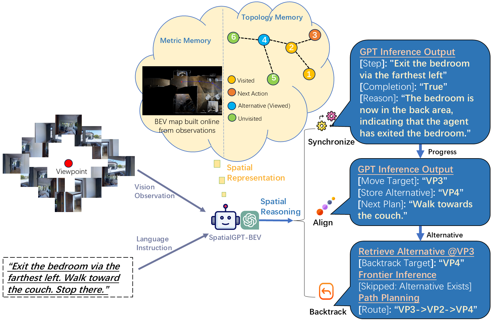
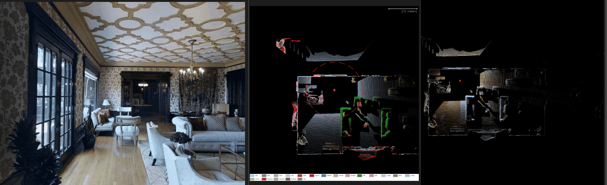

# SpatialGPT-BEV

SpatialGPT-BEV is a LLM-based agent designed for indoor zero-shot **Vision-and-Language Navigation (VLN)** task.

It extends [SpatialGPT](https://github.com/nobodynovember/SpatialGPT) by introducing a **unified topological–metric memory**.
<p align="center">
  
</p>

Key Features:
- **Spatio-Temporal Reasoning Chain**  
  A structured multi-step reasoning framework for navigation under partial observability.
- **BEV-based Navigation Memory (BNM):**  
  Metric memory records geometry, semantic, and trajectory information.
- **Directional Connected Landmark List (DCLL)**  
  Local topological memory encoding directional landmark relationships.
- **Spatial Knowledge Graph (SKG)**  
  Global topological memory capturing topology, explored regions, and object relations.


## 🎬 Demo of BEV Construction (Fast Playback)
Instruction: "Walk through the large room past the sitting areas. Go through the door left of the tapestry and enter a wood paneled room with a circle table in the middle. Go up the stairs and stop on the sixth step from the bottom."
<p align="center">
  
</p>
From left to right: orientation FPV, near-field semantic BEV, and full-scene color BEV, where the BEVs are incrementally constructed during navigation.


## 📦 Clone the Repository

```bash
git clone https://github.com/nobodynovember/SpatialGPT-BEV.git
cd SpatialGPT-BEV
```


## ⚙️ Installation

1. Matterport3D simulator docker installation instruction: [here](https://github.com/peteanderson80/Matterport3DSimulator)
2. Habitat-sim installation instruction: [here](https://github.com/facebookresearch/habitat-sim/blob/main/BUILD_FROM_SOURCE.md)
3. Install dependencies:
```bash
conda create -n spatialgpt-bev python=3.10
conda activate spatialgpt-bev
pip install -r requirements.txt
```

## 📂 Data Preparation

1. To accelerate simulation, observation images should be pre-collected from the simulator. You can use your own saved images or use the [RGB_Observations.zip](https://connecthkuhk-my.sharepoint.com/:f:/g/personal/jadge_connect_hku_hk/Eq00RV04jXpNkwqowKh5mYABBTqBG1U2RXgQ7FvaGweJOQ?e=rL1d6p)  pre-collected in prior research work. Next, set DATA_ROOT in the scripts/spatialgpt-bev.sh file to the image directory.

2. To construct accurate BEVs, download the full MP3D dataset for Habitat as instructed [here](https://github.com/facebookresearch/habitat-sim/blob/main/DATASETS.md#matterport3d-mp3d-dataset), and then create a link from bevbuilder/mp3d to this dataset directory.

3. For the validation unseen set in experiment, follow [DUET](https://github.com/cshizhe/VLN-DUET/) to set the [annotations](https://www.dropbox.com/sh/u3lhng7t2gq36td/AABAIdFnJxhhCg2ItpAhMtUBa?dl=0) for testing on the val-unseen split. 

4. For the various-scenes set in experiment, once the above annotationss setting is complete, move the file SpatialGPTBEV_72_scenes_processed.json from current directory to the 'datasets/R2R/annotations/' directory.

5. For semantic grounding, download the LSeg checkpoint (demo_e200.ckpt) as instructed [here](https://github.com/isl-org/lang-seg), and place it under the bevbuilder/lseg/checkpoints directory .


## 🔑 Set OpenAI API Key

Fill in your API key at Line 12 of the file: GPT/api.py. 


## ▶️ Run SpatialGPT-BEV

```bash
export PYTHONPATH=$PYTHONPATH:/path/to/SpatialGPT-BEV
bash scripts/spatialgpt-bev.sh
```

Note: If the MatterSim module is not found at runtime, it may have been built with a different Python version. Please rebuild MatterSim with Python 3.10 to ensure compatibility. 

## 📬 Contact

If you have any questions, please contact:

zhiqiang.jiang@ucalgary.ca
